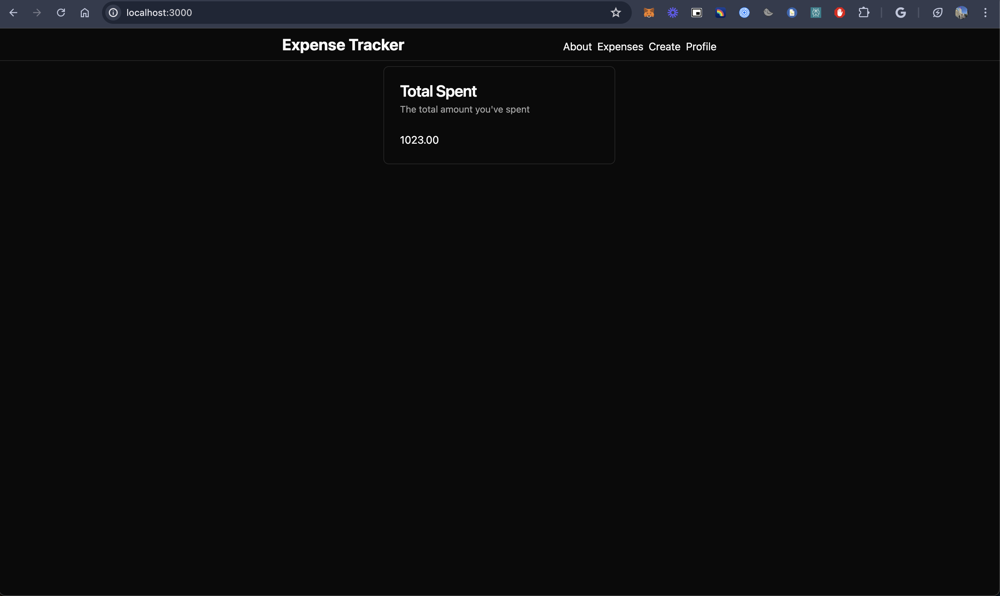
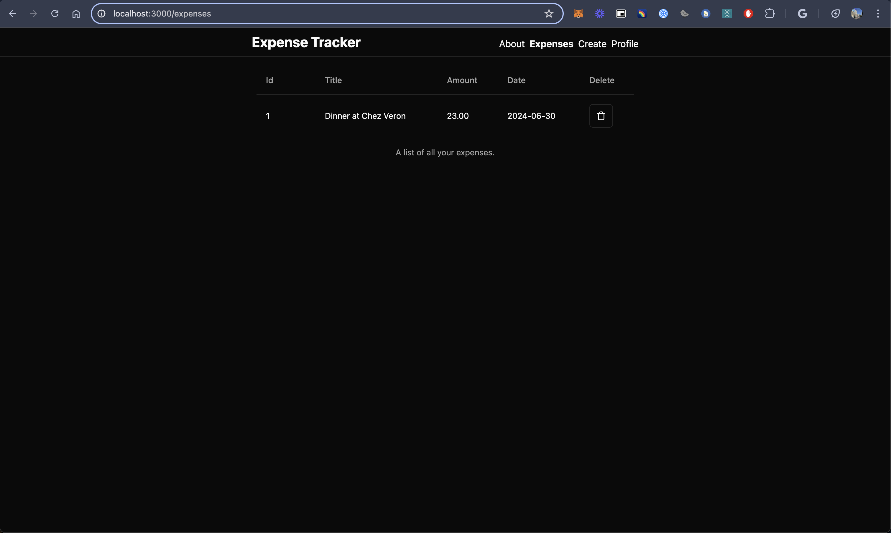
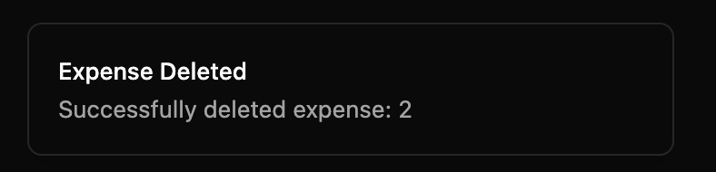
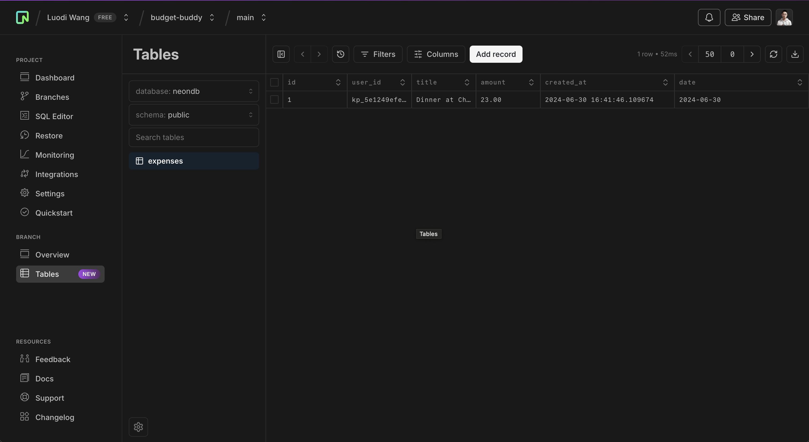

<div align="center">
<pre>
Budget Buddy
</pre>

</div>

### What is Budget Buddy?
_______________________________________________________________________________________________________________________________________________________________________
Budget Buddy is an app that tracks your expenses- and organizes them in a simple format. Budget Buddy serves as an expense tracker for hundreds of school clubs; next steps are to build a centralized dashboard tracking all expenses across clubs.

Created with Bun, Hono, PostgreSQL, Vite and React, TypeScript, Tailwind, Shadcn UI, and deployed on Docker.

### Application 
_______________________________________________________________________________________________________________________________________________________________________
Total expenses:


Each expense:


Delete an expense:


Expenses showing up in PostgreSQL DB:


### Running the application on localhost
_______________________________________________________________________________________________________________________________________________________________________
First, create a .env file with the following: 
DATABASE_URL 

KINDE_DOMAIN

KINDE_CLIENT_ID

KINDE_CLIENT_SECRET

KINDE_REDIRECT_URI

KINDE_LOGOUT_REDIRECT_URI

Install dependencies and run dev server:
```bash
bun install
```

```bash
cd frontend
bun install
```

```bash
cd ..
bun run start
```

```bash
cd frontend
bun run dev
```
